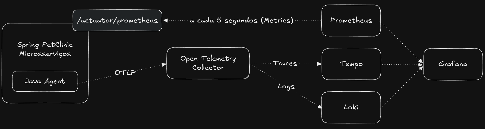
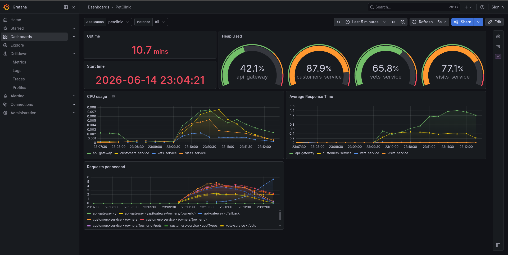
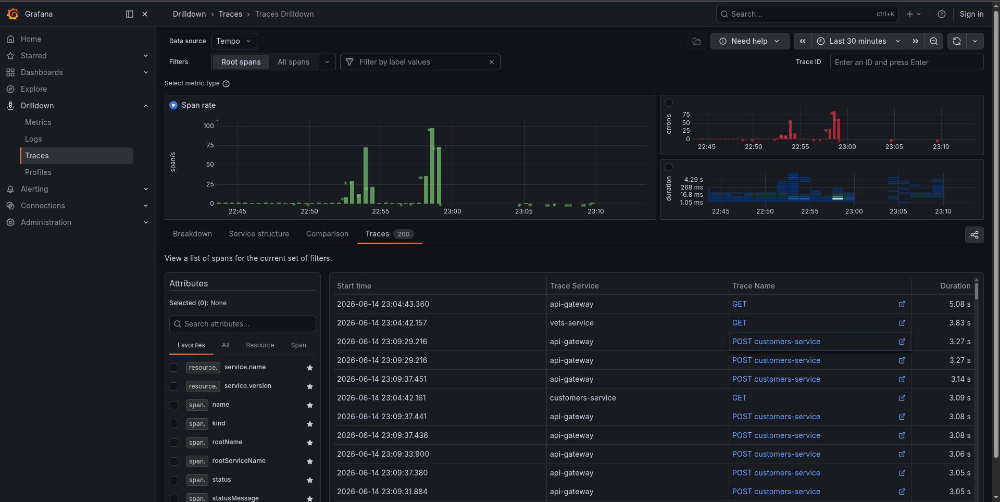
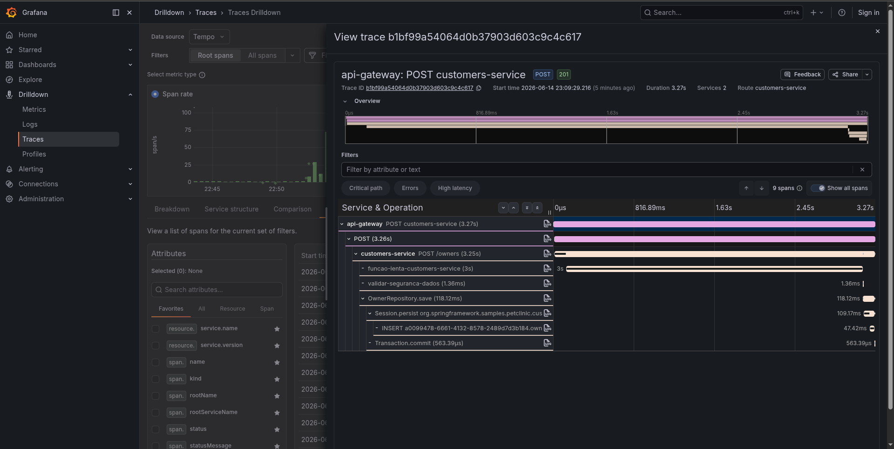
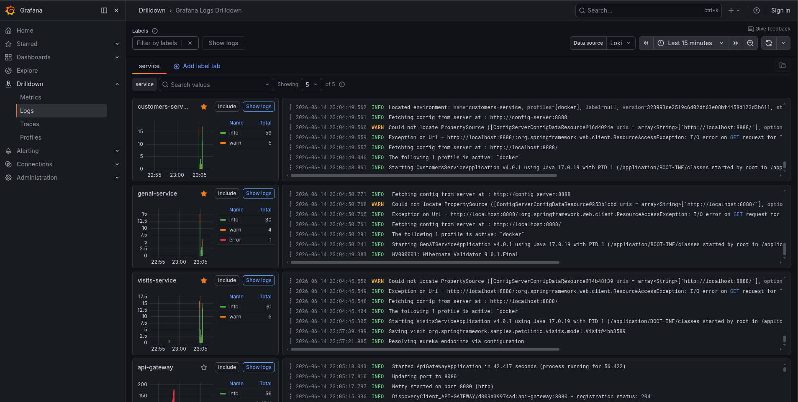

# Observabilidade no Spring PetClinic com OpenTelemetry

Este repositório contém a implementação prática dos três pilares da observabilidade (**traces**, **métricas** e **logs**) aplicados ao projeto [Spring PetClinic Microservices](https://github.com/spring-petclinic/spring-petclinic-microservices), seguindo a especificação OpenTelemetry.

A stack de observabilidade (OpenTelemetry Collector, Grafana Tempo, Grafana Loki, Grafana e Prometheus) foi adicionada ao `docker-compose.yml` original e sua configuração foi centralizada no diretório `otel/` na raiz do projeto.

---

## Arquitetura



Resumo do fluxo:

- Cada microsserviço roda com o **OpenTelemetry Java Agent** injetado via `JAVA_TOOL_OPTIONS` no `docker-compose.yml`.

- O agente envia **traces e logs** via OTLP para o **OpenTelemetry Collector**.

- Traces vão para o **Grafana Tempo** e logs para o **Grafana Loki**.

- As **métricas** seguem um caminho separado: cada serviço expõe `/actuator/prometheus` e o **Prometheus** faz o scrape direto desses endpoints.

- O **Grafana** consome os três datasources (Tempo, Loki, Prometheus) e tem a correlação entre Tempo e Loki configurada, permitindo ir de um trace direto para os logs daquela requisição (e vice-versa).

---

## Como executar

### 1. Build das imagens

```bash
./mvnw clean install -P buildDocker
```

### 2. Subir o ambiente

```bash
docker compose up -d
```

### Acessos

| Serviço                          | URL |
|----------------------------------|---|
| API Gateway (Frontend - Angular) | http://localhost:8080 |
| Grafana                          | http://localhost:3000 |
| Prometheus                       | http://localhost:9091 |
| Grafana Tempo                    | http://localhost:3200 |
| Grafana Loki                     | http://localhost:3100 |

O Grafana já vem com acesso anônimo habilitado como admin e os três datasources pré-configurados, não é preciso fazer login nem configurar nada manualmente.

___

## Implementação

### Traces

- O **O Java Agent** é baixado em um Dockerfile próprio (`otel/Dockerfile`) e compartilhado com os serviços via volume no `docker-compose.yml`.

- Cada serviço sobe com `JAVA_TOOL_OPTIONS=-javaagent:/otel/otel-javaagent.jar`, instrumentando automaticamente o serviço.

- Os traces são enviados via protocolo OTLP ao OpenTelemetry Collector, que exporta para o Tempo.

- Em `customers-service`, foi adicionada instrumentação manual com `@WithSpan` em dois métodos criados intencionalmente para serem problemáticos :
    
    - `funcaoLenta()`: simula um gargalo com `Thread.sleep(3000)`, para visualizar no gráfico de cascata qual span concentra a latência.

    - `verificarSegurancaDados()`: valida o telefone do dono cadastrado e lança erro caso o telefone comece com "000", usado para testar a correlação de logs e traces.

### Métricas

- Adicionado o Spring Boot Actuator em cada serviço, expondo dados em `/actuator/prometheus`.

- O Prometheus faz scrape a cada 5 segundos dos serviços `customers-service`, `visits-service`, `vets-service` e `api-gateway`.

- `OTEL_METRICS_EXPORTER=none` em todos os serviços no `docker-compose.yml` para evitar que o agente também exporte métricas, já que isso ficou a cargo do Actuator.

- `MANAGEMENT_METRICS_DISTRIBUTION_PERCENTILES-HISTOGRAM_HTTP_SERVER_REQUESTS=true` em todos os serviços no `docker-compose.yml` parar habilitar o cálculo de percentis (P95/P99) das requisições HTTP.

### Logs

- Adicionado `logback-spring.xml` em `api-gateway`, `customers-service`, `vets-service` e `visits-service`, usando o `logstash-logback-encoder` para gerar logs em formato JSON.

- O **Java Agent** injeta automaticamente `trace_id`, `span_id` e `trace_flags` no MDC, que são incluídos em cada linha de log pelo encoder.

- Os logs seguem o mesmo caminho dos traces (OTLP via Collector), mas são exportados para o Loki.

- Com isso, é possível pegar o `trace_id` de um log de erro no Loki e abrir o trace correspondente no Tempo, fechando o ciclo de causa raiz.

---

## Dashboards

### Métricas



### Traces





### Logs


